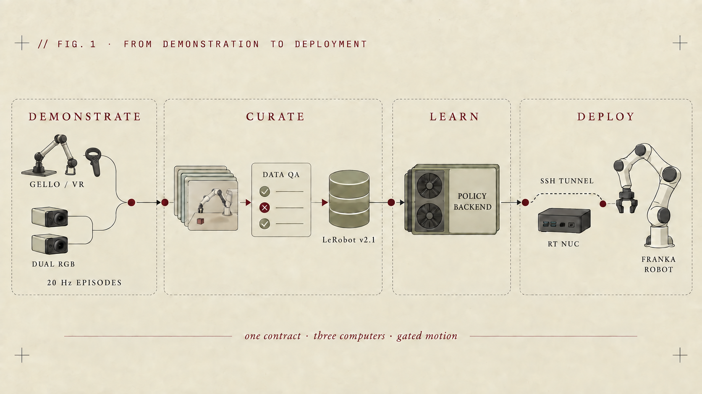
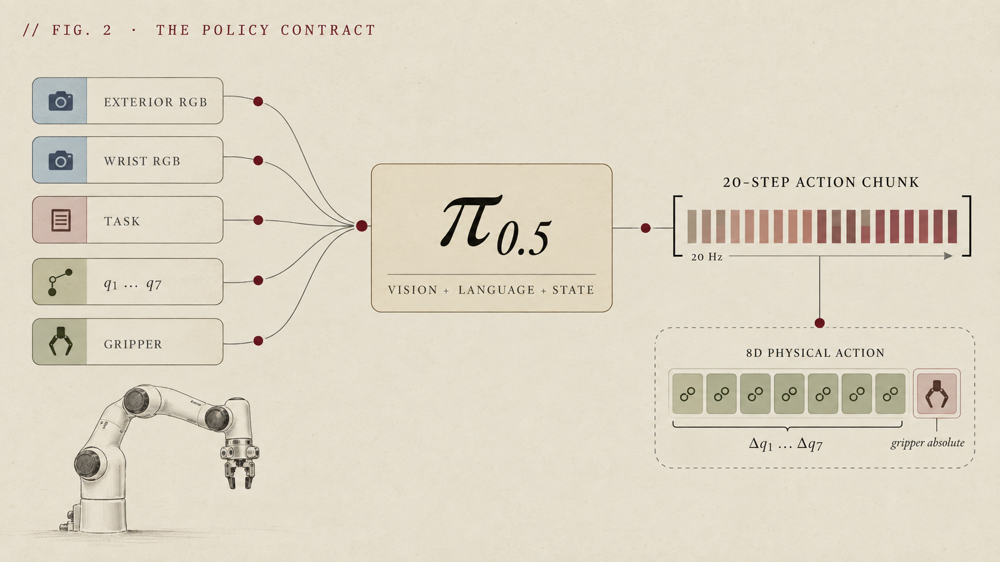

# Franka Stack

**English** | [简体中文](README.zh-CN.md)

Build a real Franka system from scratch—from hardware setup and teleoperation data collection to policy training and physical-robot deployment.

Franka Stack separates the model and robot layers: π0.5 is the current reference policy backend, Panda / Polymetis is the current reference hardware adapter, and the same boundary is designed for Research 3 / ROS 2 and future Franka profiles.

[Handbook](docs/franka/README.md) · [Architecture](docs/franka/01-architecture-and-scope.md) · [Extension guide](docs/franka/13-extending-franka-stack.md) · [Data collection](docs/franka/05-teleop-and-collection.md) · [Real-robot deployment](docs/franka/08-deploy.md)

> [!IMPORTANT]
> Franka Stack builds on components and workflows used with physical robots, but hardware revisions, Robot System versions, end effectors, networks, and lab safety setups vary. Treat the provided profiles as reproducible reference baselines, follow the [safety gates](docs/franka/02-safety.md), and adjust only after validating the change on your own setup. If you encounter a compatibility issue, please share the configuration, failure, and solution through an issue or pull request. This project does not replace a risk assessment, E-stop, guarding, or trained onsite supervision.



## One pipeline, two replaceable boundaries

| Layer | Stable responsibility | Current reference | Extension direction |
| --- | --- | --- | --- |
| Shared pipeline | Episodes, data QA, training assets, provenance, and deployment gates | `franka-runtime/v1` | Remain fail-closed and independent of one model or driver |
| Policy backend | Observation transform, training, action chunks, and inference serving | OpenPI π0.5 | Add another backend without weakening the physical contract |
| Hardware adapter | State, arm/gripper commands, limits, local stop, and real-time loop | Panda / Polymetis | Research 3 / franka_ros2 and other separately validated Franka profiles |

A model never talks directly to FCI, and a new robot cannot inherit old limits or checkpoints by changing a model-name string. See [Extending Franka Stack](docs/franka/13-extending-franka-stack.md) for adapter responsibilities and the definition of “supported.”

OpenPI lives in the pinned [`third_party/openpi`](third_party/openpi) Git submodule. Its upstream history and contributors remain in the separate [`openpi-franka`](https://github.com/Loule0-0/openpi-franka) fork; this parent history contains only Franka Stack work. Initialize that top-level submodule so the reference policy backend is present; OpenPI's unrelated nested ALOHA/LIBERO submodules are not required for this path.

## What the repository covers

| Stage | Reusable output |
| --- | --- |
| Setup | Robot System / libfranka compatibility, PREEMPT_RT host, and direct FCI networking |
| Low-level control | 1 kHz loop, separate arm/gripper ownership, fail-closed checks, and a hardware profile |
| Demonstrations | GELLO path, VR adapter boundary, dual RGB roles, and 20 Hz episode recording |
| Data | LeRobot v2.1 conversion, manifests, cadence checks, round-trip QA, and provenance |
| Policy | `pi05_franka_jointpos` today; training and serving live behind a replaceable backend |
| Real deployment | Loopback policy server, SSH tunnel, metadata handshake, and shadow → armed gates |

## Project status

| Capability | Status | Meaning |
| --- | --- | --- |
| Handbook, contract, conversion, and deployment tooling | ✅ Offline checked | Code, tests, docs, and command entry points are in the repository |
| π0.5 policy backend | ✅ Offline checked | 8D physical semantics, 20-step chunks, and checkpoint provenance |
| Panda / Polymetis adapter | ✅ Reference profile | Built from real-robot components with exact versions and patch pinned; repeat the gates on the target installation |
| Research 3 / ROS 2 adapter | 🧭 Integration target | Interface exists; runner and physical validation are not complete |
| Physical Franka end-to-end reproduction | 🧩 Setup-dependent | Validate the complete profile against the local robot, end effector, network, and safety setup |
| Production-scale GPU training | 🧪 Pending | Configuration and runbook exist; no public result checkpoint yet |

“Offline checked” describes the automated test evidence reported for this repository revision; it does not negate the real-robot use of the underlying components. Hardware-dependent gates must still be repeated for each installation.

## Choose a path

- **Build from scratch:** follow the [ordered handbook](docs/franka/README.md) through identity, safety, RT/FCI, low-level control, collection, data, training, and deployment.
- **Add another Franka model:** begin with [architecture boundaries](docs/franka/01-architecture-and-scope.md) and the [extension guide](docs/franka/13-extending-franka-stack.md). Create a separate hardware profile before touching motion.
- **Start with demonstrations:** validate them against the [data contract and QA](docs/franka/06-data-contract-and-qa.md), then use the current [π0.5 reference backend](docs/franka/07-train-pi05.md).
- **Own only deployment:** complete [safety](docs/franka/02-safety.md) and hardware-adapter acceptance first, then follow [deployment](docs/franka/08-deploy.md) through loopback, SSH, shadow, and low-risk motion.

Use [layered troubleshooting](docs/franka/09-troubleshooting.md) when a gate fails. Persistent server layout, GPU checks, and recovery commands are in the [server runbook](docs/franka/10-server-runbook.md).

## Validate without a robot

These commands do not connect to or command hardware. The first sync downloads OpenPI dependencies:

```bash
git clone https://github.com/Loule0-0/franka-stack.git
cd franka-stack
git submodule update --init third_party/openpi
uv sync --frozen --dev
uv run pytest -q
git submodule status
```

On Linux or WSL, also syntax-check the operations scripts:

```bash
bash -n scripts/franka/*.sh deploy/panda-polymetis/*.sh
```

## Current reference policy contract

The following figure describes the π0.5 backend, not a permanent restriction on Franka Stack.



| Item | Current `panda-polymetis + pi05` profile |
| --- | --- |
| Schema / rate | `franka-runtime/v1` / `20 Hz` |
| Images | `exterior_image`, `wrist_image`; RGB `uint8` HWC |
| State / action | `[q1..q7, gripper_closed]`; 8D absolute targets |
| Training transform | Delta only for the first seven joints; gripper remains absolute |
| π0.5 output | `action_dim=32`; adapter consumes the first 8 dimensions; `action_horizon=20` |

Every new model or robot profile must state camera roles, units, joint order, gripper semantics, control mode, rate, and limits. If any of those differ, create a new schema and normalization statistics instead of relaxing the existing validator.

## The endpoint is a physical Franka

GPU inference is not part of the real-time loop. The policy server binds to loopback, reaches the operator workstation through SSH, and crosses into the RT NUC only after metadata, limits, shadow, and armed gates have passed.


| Role | Runs here | Does not run here |
| --- | --- | --- |
| RT NUC | Hardware adapter, libfranka / franka_ros2, local FCI loop, local stop | GPU inference, camera encoding, dataset writes |
| Operator workstation | GELLO / VR, cameras, episode recorder, policy client, gate management | The 1 kHz FCI loop |
| GPU server | Data QA, normalization, policy training, loopback-only inference server | Direct FCI control or a public websocket |

## Hardware profiles

| Profile | Status | Boundary |
| --- | --- | --- |
| `panda-polymetis` | Current reference implementation | Robot System 4.0.0, libfranka 0.9.0, and Polymetis; the frozen legacy stack is a compatibility choice, not a recommendation for new systems |
| [`fr3-ros2`](deploy/fr3-ros2/README.md) | Interface present, runner absent | Select libfranka / franka_ros2 from the onsite Robot System and establish independent limits, gripper semantics, metadata, and regression evidence |
| Another Franka profile | Extensible | Mark supported only after adapter, schema, QA, shadow, stop, and physical motion gates all pass |

The supplied FR3 + π0.5-DROID field setup is documented as an [independent reference](docs/franka/11-fr3-droid-reference.md). Its versions, 15 Hz velocity actions, cameras, and gripper must not masquerade as the current profile.

## Evidence and next milestones

The clean parent baseline passed Ruff, Python compilation, `uv lock --check`, Markdown link checks, a sensitive-data scan, and **170 Python tests with 1 Windows symlink-permission skip**. The pinned OpenPI fork retains its separate lock and integration tests; synchronize that CUDA environment on the Linux GPU server rather than Windows.

Next milestones:

1. Publish repeatable Gate 0–7 hardware reports across different Franka, end-effector, and Robot System combinations.
2. Release a privacy-clean sample dataset, normalization statistics, and auditable checkpoint.
3. Implement and validate the `fr3-ros2` hardware adapter with a separate schema.
4. Add a non-π0.5 policy backend to prove that the model boundary is genuinely replaceable.

Issues and pull requests are welcome. Hardware reports should include robot model and system version, the Franka Stack commit, the pinned OpenPI submodule commit, hardware and policy profiles, the last passed gate, complete logs, and whether motion occurred. Never upload credentials, private network details, or unredacted demonstrations.

## Upstream, license, and security

The current policy backend uses a pinned [OpenPI integration fork](https://github.com/Loule0-0/openpi-franka), based on [Physical Intelligence/OpenPI](https://github.com/Physical-Intelligence/openpi). Hardware and collection paths reference [GELLO](https://github.com/wuphilipp/gello_software), [Polymetis](https://facebookresearch.github.io/fairo/polymetis/), and the [Franka FCI documentation](https://frankarobotics.github.io/docs/). Franka Stack focuses on the auditable boundary from data to a physical Franka.

Parent code is provided under the [Apache-2.0 license](LICENSE). Submodule code and model components retain their own licenses, including OpenPI's Gemma terms; see the [third-party notice](NOTICE.md). Do not commit GitHub PATs, SSH keys, Hugging Face / W&B tokens, robot credentials, datasets, or large checkpoints.
