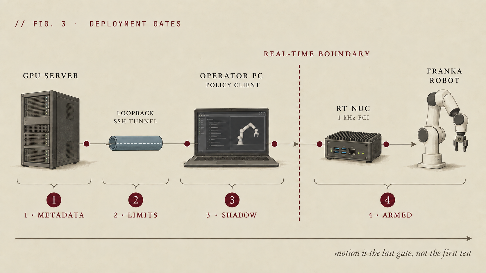

# Guarded remote deployment

**English** | [简体中文](../zh-CN/franka/08-deploy.md)

Deployment has three independent fault domains: the GPU server performs policy inference, the operator workstation validates metadata and manages chunks, and the RT NUC owns the local Franka / FCI loop. A public-network failure must cause a local stop; recovery cannot depend on the server.

The current executable path is `pi05 + panda-polymetis`. Research 3 requires its own accepted hardware adapter.

> [!CAUTION]
> These commands are setup-dependent and must pass the local hardware gates before motion. `deploy.py` is not a certified safety controller and has no software deadman. An onsite operator must control the verified external enabling/stop path, with an observer present.

## Topology and gates



1. **Metadata:** policy schema, hardware profile, model type, horizon, rate, and provenance match exactly.
2. **Limits:** every state and action is finite, correctly shaped, and inside conservative profile limits.
3. **Shadow:** cameras, state, network, and policy run while no command reaches the robot.
4. **Armed:** a deliberate onsite action enables one bounded trial; motion is the final gate.

## Start the server on loopback

```bash
bash scripts/franka/serve_pi05.sh --help
```

Bind the policy websocket to `127.0.0.1`. Never open it in a cloud security group or public firewall.

## Establish the SSH tunnel

From the operator workstation, forward a local port to the GPU server's loopback address. Verify that the port is unavailable before the tunnel and available only while the tunnel is active. Do not tunnel the Polymetis or FCI ports over the public network.

## Run the client in shadow mode

```bash
uv run python examples/franka_real/deploy.py --help
```

The client must reject incomplete or unknown metadata, discard the warmup chunk, bound chunk age and per-step change, and stop on stale cameras, stale robot state, timeout, NaN, limit violation, or disconnect. Log proposed and filtered actions without forwarding them.

## Arm a physical trial

Only after the shadow trace is reviewed:

1. Place the robot in the recorded safe initial region using an explicit procedure.
2. Confirm the operator, observer, stop device, exclusion zone, and planned task.
3. Arm one short, low-speed episode.
4. Stop immediately on any unexpected state, sound, latency, direction, or gripper behavior.
5. Save the gate results, stop reason, logs, video, commit, dataset, and checkpoint.

**Exit gate:** loopback exposure, SSH lifecycle, metadata handshake, warmup rejection, shadow output, local disconnect stop, and one bounded physical run are all documented.
